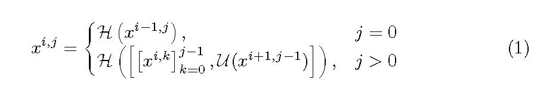
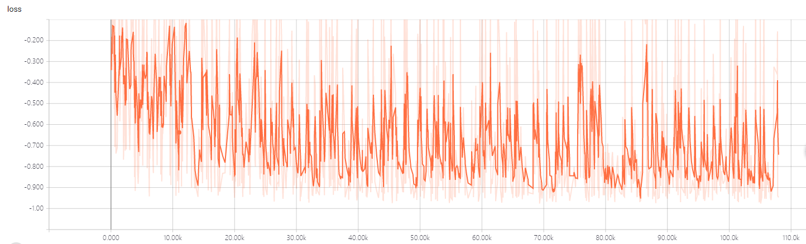
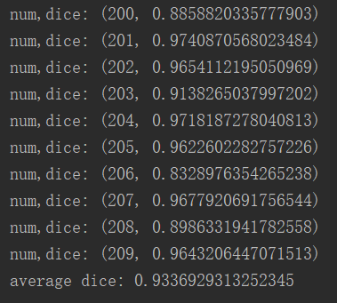

# Nested VNet3D Model for KiTS19——2019 Kidney Tumor Segmentation Challenge
> This is an example of Nested VNet3D.(re)implemented the model with tensorflow framework in the paper of "Zongwei Zhou, Md Mahfuzur Rahman Siddiquee, Nima Tajbakhsh, Jianming Liang.(2018) UNet++: A Nested U-Net Architecture for Medical Image Segmentation"

## Prerequisities
The following dependencies are needed:
- numpy >= 1.11.1
- opencv-python >=3.3.0
- tensorflow-gpu ==1.8.0
- pandas >=0.20.1
- scikit-learn >= 0.17.1

## How to Use

*Preprocess*

follow KiTS19——2019 Kidney Tumor Segmentation Challenge project

* the VNet3D++ model

* the skip pathway function

## Prerequisities
UNet++: A Nested U-Net model can find from here:https://github.com/MrGiovanni/UNetPlusPlus

## Result
**1、Kidney Segmentation**
* the train loss

* 200-209case dice value and result

* segmentation result can find in the video of VNet++.avi

## Contact
* https://github.com/junqiangchen
* email: 1207173174@qq.com
* Contact: junqiangChen
* WeChat Number: 1207173174
* WeChat Public number: 最新医学影像技术
